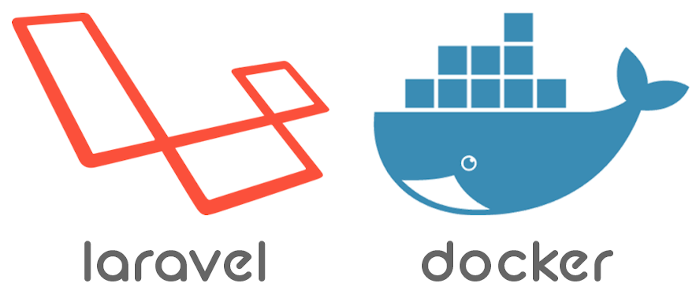

# Ambiente Laravel com Docker e Docker-Compose

 

## Introdução

Crie um ambiente de **DEV** com Laravel de forma **Extremamente Rápida**.\
Seguindo os passos abaixo, você vai subir na sua máquina esse ambiente através do Docker e Docker-Compose.\
Irá subir 3 Containers cada qual com sua aplicação e conectados entre si, você pode usar essa base para
**Outras Aplicações Laravel ou PHP** que está desenvolvendo.

O que vai subir usando o docker-compose:

- **Um Container com a Aplicação do Laravel**
- **Um Container com uma base de Dados Mysql**
- **Um Container com o PHPMyadmin para gerenciar o banco de dados Mysql**

**Tudo isso em alguns comandos:**

- **Caso não tenha Docker e Docker-Compose instalado na máquina:**
- Execute a [Etapa 1](#etapa-1) para instalação no Ubuntu 18.04/20.04
- **Caso tenha outro sistema operacional:**
- Instale através do link -> <https://docs.docker.com/compose/install/>
- **Depois de instalado docker e docker-compose:**
- Execute a [Etapa 2](#etapa-2)

**Com Docker e Docker-Compose esse ambiente de DEV pode ser criado em qualquer Sistema Operacional.**

## Etapa 1

**Instalando os pacotes base no Ubuntu 18.04/20.04.**

```bash
sudo apt-get update
sudo apt-get install -yq apt-transport-https ca-certificates software-properties-common
sudo apt-get install -yq docker.io socat lxc git-core
sudo apt-get install -yq python3-pip python3-dev python3-setuptools
sudo usermod -aG docker $USER

sudo -H pip3 install --upgrade pip
sudo -H pip3 install docker-compose
docker-compose version
```

## Etapa 2

**Criando uma app Laravel do Zero.**

```bash
git clone https://github.com/jniltinho/laravel-docker.git
cd laravel-docker

## Caso você esteja no Linux/Mac, execute os passos abaixo:
docker run --rm -it -v $PWD:/app -u $(id -u):$(id -g) composer create-project --prefer-dist laravel/laravel lara-app
chown -Rf $(id -u):$(id -g) lara-app
cp docker-compose.yaml Dockerfile lara-app/

## Caso você esteja no Windows, execute os passos abaixo:
docker run --rm -it -v $PWD:/app composer create-project --prefer-dist laravel/laravel lara-app
docker run --rm -it -v $PWD:/app composer cp docker-compose.yaml Dockerfile lara-app/

## Depois execute os passos abaixo para todos SOs
cd lara-app
docker-compose up -d --build
docker-compose ps

docker-compose exec laravel-app chmod -R gu+w storage
docker-compose exec laravel-app chmod -R guo+w storage
docker-compose exec laravel-app sed -i 's|DB_HOST=127.0.0.1|DB_HOST=mysql-app|' .env
docker-compose exec laravel-app sed -i 's|DB_PASSWORD=|DB_PASSWORD=laravel|' .env
docker-compose exec laravel-app php artisan migrate
```

## Acessos das aplicações

- App Laravel: http://127.0.0.1:8080
- PHPMyadmin: http://127.0.0.1:8085
- Mysql PORTA: 3306, SERVER: mysql-app, LOGIN: root, PASS: laravel

## Comandos Docker e Docker-Compose

```bash
docker exec -it lara-app_laravel-app_1 /bin/bash
docker-compose ps
docker-compose exec laravel-app /bin/bash
docker-compose exec laravel-app php artisan cache:clear
docker-compose exec laravel-app php artisan key:generate
docker-compose exec laravel-app ls -l
docker-compose down
```

## Links usados nesse projeto

- <https://github.com/rmsaitam/project-laravel-docker>
- <https://www.digitalocean.com/community/tutorials/how-to-set-up-laravel-nginx-and-mysql-with-docker-compose-pt>
- <https://www.digitalocean.com/community/tutorials/how-to-containerize-a-laravel-application-for-development-with-docker-compose-on-ubuntu-18-04-pt>

## Esse repo foi criado com base nos tutoriais abaixo

- [Docker em 22 Minutos](https://www.youtube.com/watch?v=Kzcz-EVKBEQ)
- [NodeJS e Docker + Docker-Compose](https://www.youtube.com/watch?v=AVNADGzXrrQ)
- [Vídeo 1 Docker-Compose](https://www.youtube.com/watch?v=HxPz3eLnXZk)
- [Vídeo 2 Docker-Compose](https://www.youtube.com/watch?v=VXTQFhy7Dt8)s
- [Tutorial laravel](https://fullcycle.com.br/docker-e-docker-composer-na-pratica-criando-ambiente-laravel/)
- [Vídeo Laravel](https://www.youtube.com/watch?v=vnE9fCCGNWw)
